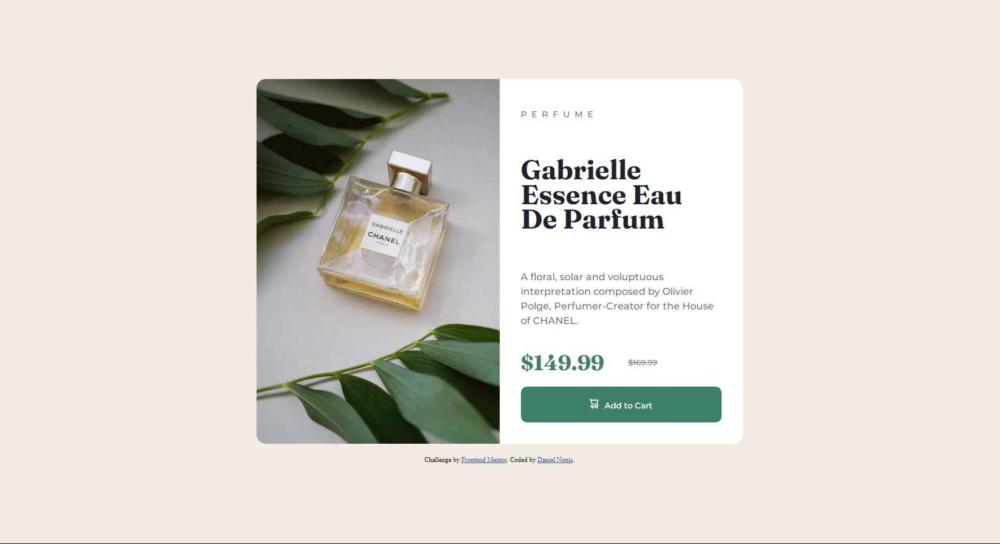

# Frontend Mentor - Product preview card component solution

This is a solution to the [Product preview card component challenge on Frontend Mentor](https://www.frontendmentor.io/challenges/product-preview-card-component-GO7UmttRfa). Frontend Mentor challenges help you improve your coding skills by building realistic projects. 

## Table of contents

- [Overview](#overview)
  - [The challenge](#the-challenge)
  - [Screenshot](#screenshot)
  - [Links](#links)
- [My process](#my-process)
  - [Built with](#built-with)
  - [What I learned](#what-i-learned)
  - [Continued development](#continued-development)
  - [Useful resources](#useful-resources)
- [Author](#author)
- [Acknowledgments](#acknowledgments)

## Overview

### The challenge

Users should be able to:

- View the optimal layout depending on their device's screen size
- See hover and focus states for interactive elements

### Screenshot

### Links

- Solution URL: [Add solution URL here](https://your-solution-url.com)
- Live Site URL: [Add live site URL here](https://your-live-site-url.com)

## My process

I started with the container then separated it into a left and right panel. On the left I put the image and resized it until it fit and also gave it the same border-radius as the container. On the right I gave the text the (hopefully!) correct html semantic markings and classes. Something that took me longer than I thought would be was the new price/old price line but I think i dealt with it well by surrounding each price in a span element. As for the continue button I put the image within the button element in the HTML and then gave it padding-right to distance it from the text but I feel the process for having an icon and text in the same line could be faster/better than what I did.
When I was starting the mobile desing I stumbled into the problem of not knowing how to change the image of the product, but I went to stack overflow and got some help, which is why I use the "picture" attribute. Then I changed the border-radius of the image and container so it's both top corners (specifically of the image) and the flex-direction to column so the panels went from being left-right to top-down (left-panel and right-panel were the original names of the divs but I changed them because it wouldn't make sense in the mobile version). Then I changed the panels' width to 100% (since it's not a 50/50 horizontal split in the main.container) than I did some small adjusting width font-sizes (because I don't really understand the difference between em and rem).

### Built with

- Semantic HTML5 markup
- CSS custom properties
- Flexbox

### What I learned

I learned how to do media queries! I'm far from being good at it but it's really nice to see that I can actually design with different measures and have them work. Also learned to be a little more precise with css properties and HTML semantic markings. I know I was advised to not use % for width/height but since I only used them for the inner element of a strictly measured element I think it should be fine, right?

### Continued development

I'd like to: 
- Be more proficient with media queries so that a design can look good as it's being actively resized instead of working on just two precise settings.
- Be more precise in font-size (usage of em-rem).

### Useful resources

- Stack Overflow - As I mentioned, it was a big help with the picture attribute for image switching.
- W3Schools - It helped me familiarize myself with the media queries.

## Author

- Frontend Mentor - [@Xarxytarsan](https://www.frontendmentor.io/profile/Xarxytarsan)

## Acknowledgments

Special thanks to:

- Danielmrz-dev for helping with HTML semantics and accessibility issues.
- Marcos Travaglini for the tips on flexbox and semantics/accessibility.

